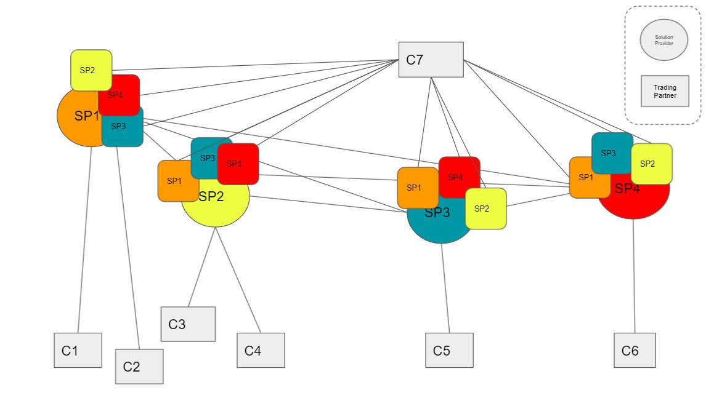
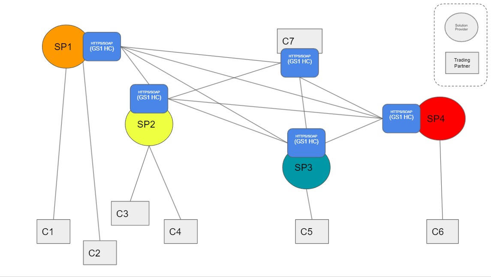
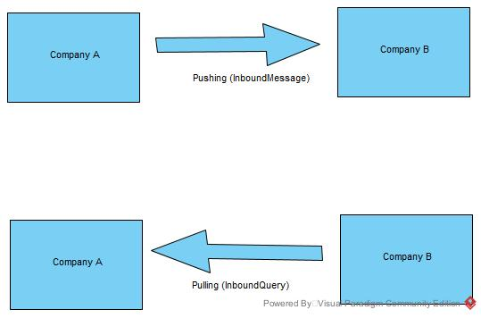
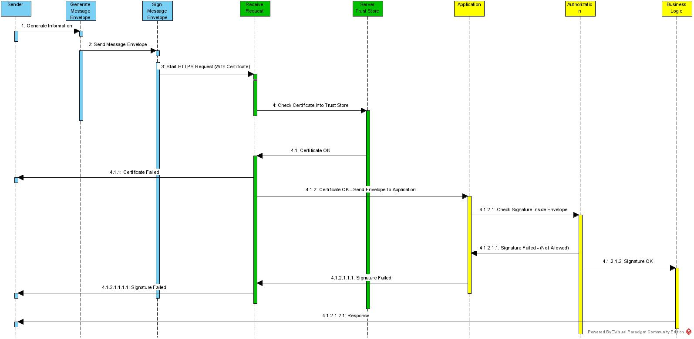

# The Horizontal Communication Standard

The information on this page explains how the horizontal communication (HC) in Brazil works.

### What is Horizontal Communication?

If you are reading this document, probably you are developing something or in charge to implement a traceability project following the Brazilian Regulation.

Based on ANVISA´s decision to keep their focus to handle only the Vertical Communication, the market had to find a collaborative way to technically align on how the track & trace communication among trading partners will occur. This alignment also had a basic assumption that trading partners should not implement two different communication models for the same market.



This search for an effective solution also considered standard interfaces as a way to provide faster onboarding to the trading partners in Brazil. Looking only in the private market, Brazil has more than 70000 drugstores, 2000 distributors, and 400 manufacturers to connect. It can consume a lot of time (and money) if we follow the traditional approach that service providers usually use to connect trading partners.



In the image below the red line represents the Vertical Communication, which is the data exchange happening between companies and the regulatory authority (ANVISA). The data exchange in blue represents the communication among trading partners in the supply chain, which is the focus of this HC standard.


### What does this standard implement?

This standard created by participants of a focused GS1 Brazil Workgroup developed some common artifacts that will enable the interoperability among trading partners. These artifacts are formed by a set of Interfaces and Messages that act as a glue across companies within the supply chain. The messages here developed implement a **Transport Layer** that can be considered as an Envelope that carries **preferably** the SNCM (or any other) message from one Trading Partner to another one. These messages are not implementing any Business Rule and are not restricting the content to be delivered. It allows trading partners to exchange different types of files such as the **SNCM** messages, **EPCIS messages**, **Electronic Invoice**, etc.

This standard also implements a common Query Interface that enables companies to query information from their trading partners’ webservices. It means that the standard enables either a pushing or pulling strategy.



### What do we have in this HC Standard?

The standard basically helps companies on the implementation of a Webservice with 3 simple methods that allow the data exchange among companies. In addition, we also developed some XML artifacts that can act as an Envelope to provide a standard way to package and route messages through the supply chain.

### What is the technology and the security aspects of this HC Standard?

At early stages of the GS1 Workgroup effort, the participants aligned on assumptions that could speed up the development of the standard and focused on the most critical decisions needed.

The main assumption was that the group would not focus on new technologies as it would drive the team to a never ending technical discussion . Nowadays there are many technical alternatives on the market for data exchange and the risk that each member of the group would have specific technical preferences could create a negative impact to the final outcome.

Based on that, the group participants decided to keep the same technological stack that ANVISA is using. With this strategy, all trading partners can save time and resources in terms of software development as the same developer who needs to implement the vertical communication with the SNCM also can develop the HC.

The HC principles are following the same technical stack as the SNCM System, meaning:

- The use of the SSL (Secure Shell Layer) over HTTP communication.

- Mutual Authentication using the ICP-Brasil Digital certificates

- Electronic Signature on the XML messages to assure the authenticity and integrity of the messages.

- SOAP Webservices

The authentication of the Horizontal Communication uses Digital Certificate with Mutual authentication to stabilish a secured channel between two parts. The authentication schema works like the image below. 

	


Below you can find a Sample Signed message with the specific tags needed by the XML Signature using X509 Certificates.

```xml
<?xml version="1.0" encoding="UTF-8"?>
<InboundMessage xmlns="http://hc.gs1br.org.br/" date="2021-10-01T16:42:00Z" id="123456978696050595050AAAABBBDDDDD">
	<sender>
		<partnerKey>CNPJ</partnerKey>
		<partnerValue>15042274000195</partnerValue>
	</sender>
	<receiver>
		<partnerKey>CNPJ</partnerKey>
		<partnerValue>15041786000176</partnerValue>
	</receiver>
	<carrier>
		<partnerKey>CNPJ</partnerKey>
		<partnerValue>15042274000195</partnerValue>
	</carrier>
	<content>
		<fileURL>https://sampleurl.sampledomain.com/fileXXXXXXXX.xml</fileURL>
	</content>
	<Signature xmlns="http://www.w3.org/2000/09/xmldsig#">
		<SignedInfo>
			<CanonicalizationMethod Algorithm="http://www.w3.org/TR/2001/REC-xml-c14n-20010315"/>
			<SignatureMethod Algorithm="http://www.w3.org/2000/09/xmldsig#rsa-sha1"/>
			<Reference URI="">
				<Transforms>
					<Transform Algorithm="http://www.w3.org/2000/09/xmldsig#enveloped-signature"/>
				</Transforms>
				<DigestMethod Algorithm="http://www.w3.org/2000/09/xmldsig#sha1"/>
				<DigestValue>1qLlpV5ntvfZyx2rn9DAreSAD1c=</DigestValue>
			</Reference>
		</SignedInfo>
		<SignatureValue>kL2Y/AaOnFnubSClHJiPZTSOpfYDh6QYQZqbgxX4VPgf9kTbIJIzHogDtdFoxg2gGQN+bUDpyaOw&#13;
TH6qdegUJKQa+s2zrI60vAEulFCltzt9l9dIDDKeo0mNHk2GRb2qnOnJ7rHmyY5Qrjuoq0hTHSJp&#13;
uvbFfYEyIQLJ2Htld3bj5P1L1ghANw0NZKq01QpblGZLei9c4Z6fRtLhyczR08UEc8gIxWKFASJd&#13;
OvNfHqAJLEzcYIP0AzZXwSreJtM3ZOXGimipbCoJjUsAZ31c8d/EUsfUu2ez5BT6m0ICXbIUP+cG&#13;
yo5UJnfAj1bcoy27Dm0w8NrfqBVtwkuWCyVhxg==</SignatureValue>
		<KeyInfo>
			<X509Data>
				<X509SubjectName>CN=T2 SOFTWARE S A:15042274000195,OU=RFB e-CNPJ A1,OU=Secretaria da Receita Federal do Brasil - RFB,OU=29277404000109,OU=VideoConferencia,L=Sao Paulo,ST=SP,O=ICP-Brasil,C=BR</X509SubjectName>
				<X509Certificate>MIIIAjCCBeqgAwIBAgIQC2LioAcGdMmoSdIbjUEVazANBgkqhkiG9w0BAQsFADB4MQswCQYDVQQG&#13;
EwJCUjETMBEGA1UEChMKSUNQLUJyYXNpbDE2MDQGA1UECxMtU2VjcmV0YXJpYSBkYSBSZWNlaXRh&#13;
IEZlZGVyYWwgZG8gQnJhc2lsIC0gUkZCMRwwGgYDVQQDExNBQyBDZXJ0aXNpZ24gUkZCIEc1MB4X&#13;
DTIxMDMxOTE5NTczMVoXDTIyMDMxOTE5NTczMVowgfAxCzAJBgNVBAYTAkJSMRMwEQYDVQQKDApJ&#13;
Q1AtQnJhc2lsMQswCQYDVQQIDAJTUDESMBAGA1UEBwwJU2FvIFBhdWxvMRkwFwYDVQQLDBBWaWRl&#13;
b0NvbmZlcmVuY2lhMRcwFQYDVQQLDA4yOTI3NzQwNDAwMDEwOTE2MDQGA1UECwwtU2VjcmV0YXJp&#13;
YSBkYSBSZWNlaXRhIEZlZGVyYWwgZG8gQnJhc2lsIC0gUkZCMRYwFAYDVQQLDA1SRkIgZS1DTlBK&#13;
IEExMScwJQYDVQQDDB5UMiBTT0ZUV0FSRSBTIEE6MTMwNDIyNzQwMDAxOTUwggEiMA0GCSqGSIb3&#13;
DQEBAQUAA4IBDwAwggEKAoIBAQC+18QseqwK5EVEKMLwifPHOmxG4V/Sj5RhBB4x9bX9UdtC1d8J&#13;
/mJhaHRiIiAQSwvPrj0TDyO/3FHoip6KY5/WcMXH6xzMgRkq2zPhWuYUqAQbWSaYXRvBgmN0ifRr&#13;
y8NWXXyrzXBtTJf5Xalh8wvXDA92BrPHjy/a1uicajXDsz7mOWNFTTU6xH/fqcKDx19zb5/+7TCp&#13;
eeLWp+rhcKiiq5TylEVibGX8O49LaXq8NjDmvx4/+xh9/BUO6hGnpyqyiqVkfd7HVd1q8lB/3jV0&#13;
ERA5AQPIiHmJCIAyQMeQZUsgVCCO9ntEok2YEpPiBpc1Qz9h8OsK8KQ9biaPFhn1AgMBAAGjggMN&#13;
MIIDCTCBvAYDVR0RBIG0MIGxoD0GBWBMAQMEoDQEMjA4MTIxOTc5MjE2MjU2MjU4ODAwMDAwMDAw&#13;
MDAwMDAwMDAwMDI5MjkxNjA5N1NTUFNQoB8GBWBMAQMCoBYEFFJPRFJJR08gS0xFSU4gU0FOVE9T&#13;
oBkGBWBMAQMDoBAEDjEzMDQyMjc0MDAwMTk1oBcGBWBMAQMHoA4EDDAwMDAwMDAwMDAwMIEbQ0FS&#13;
T0xJTkUuUEFVTElOT0BCRE8uQ09NLkJSMAkGA1UdEwQCMAAwHwYDVR0jBBgwFoAUU31/nb7RYdAg&#13;
utqf44mnE3NYzUIwfwYDVR0gBHgwdjB0BgZgTAECAQwwajBoBggrBgEFBQcCARZcaHR0cDovL2lj&#13;
cC1icmFzaWwuY2VydGlzaWduLmNvbS5ici9yZXBvc2l0b3Jpby9kcGMvQUNfQ2VydGlzaWduX1JG&#13;
Qi9EUENfQUNfQ2VydGlzaWduX1JGQi5wZGYwgbwGA1UdHwSBtDCBsTBXoFWgU4ZRaHR0cDovL2lj&#13;
cC1icmFzaWwuY2VydGlzaWduLmNvbS5ici9yZXBvc2l0b3Jpby9sY3IvQUNDZXJ0aXNpZ25SRkJH&#13;
NS9MYXRlc3RDUkwuY3JsMFagVKBShlBodHRwOi8vaWNwLWJyYXNpbC5vdXRyYWxjci5jb20uYnIv&#13;
cmVwb3NpdG9yaW8vbGNyL0FDQ2VydGlzaWduUkZCRzUvTGF0ZXN0Q1JMLmNybDAOBgNVHQ8BAf8E&#13;
BAMCBeAwHQYDVR0lBBYwFAYIKwYBBQUHAwIGCCsGAQUFBwMEMIGsBggrBgEFBQcBAQSBnzCBnDBf&#13;
BggrBgEFBQcwAoZTaHR0cDovL2ljcC1icmFzaWwuY2VydGlzaWduLmNvbS5ici9yZXBvc2l0b3Jp&#13;
by9jZXJ0aWZpY2Fkb3MvQUNfQ2VydGlzaWduX1JGQl9HNS5wN2MwOQYIKwYBBQUHMAGGLWh0dHA6&#13;
Ly9vY3NwLWFjLWNlcnRpc2lnbi1yZmIuY2VydGlzaWduLmNvbS5icjANBgkqhkiG9w0BAQsFAAOC&#13;
AgEAAd8T+YgIGpCB9gkEU4k1GCNV6Cyn3aGT0jjsk0w82weVFl7fgpSC/BBqmi53V8oHrEBd3nUU&#13;
KTdYM++iGP/mPEYIx8pmWXmgzdyol8Kd49zhUSCF+uc5WYu8/UAaX+44Af8nd/T30hlFKWy6C/jo&#13;
ES1XEhZU20u0SKVWtcLUjnupgSB7Hicv1SvF5jP7Zz7FiaFKdzOci9p/e2QP5Qv5vtpfiOXVJdYY&#13;
oM5OYCjT3xVMubj5qsmT/3LE9np4fviBoAereb+AFSfaHiticLH9dfE149TYfm23Z1Yc4GxdwsFO&#13;
EB1Jgntfk1PIZ8S8HjvFx4oxcqcov/N7xuvSRq3R3oBg6Y/2AWjIr2bCM2ya2PwgeefBTrFHnRkB&#13;
iLMkUkLdILqf6qkoKgU31Cr6/ecZqKWcGpTUG7ZeB1wm1BISJQFRMe1ueweu21SW2IAt/a//HlNg&#13;
US7p7gdi2gN/OrexJULyKsXPVJ8BizAXL5CnV3SBsuCgmqcssgL09uFiqu/vOukqS2DoMTgRJirL&#13;
hVTHGLvFjE5rTyU45i+K5+WwkCB2ZgFRY1oDwwefsQjzuWeeRLrAZVHhixgfkhq1md9cFcuyxXX9&#13;
cz5I8hk6KZenuax1QFFEoi3xsSXSNZWrUnZGYMlmQVb3D6MBtibst4zU3fOWYvuf4k8+cBzL1Ltb&#13;
sJ8=</X509Certificate>
			</X509Data>
		</KeyInfo>
	</Signature>
</InboundMessage>
```

### Anatomy of the Webservice

The technology behind the main interface of the HC is SOAP (Simple Object Access Protocol). This technology is a well-known among many companies and developers worldwide.

The HC Standard has only one webservice which contains 3 methods that enable communication.

The webservice named DataWS is responsible to make available the methods below.

| Method | Description | Input | Return|
|--------|-------------|--------|--------|
|sendMessage|Method responsible to provide a standard way to receive messages| [InboundMessage](SoapUI_Requests/sendMessageRequest.xml) |[InboundResponse](SoapUI_Requests/sendMessageResponse.xml)|
|getMessage| Method responsible to provide a query interface with the system| [QueryRequest](SoapUI_Requests/getMessageRequest.xml) |[QueryResponse](SoapUI_Requests/getMessageResponse.xml) |
|getPreferences|Method responsible to provide the partner preferences to the network| [QueryRequest](SoapUI_Requests/getPreferencesRequest.xml) |[PreferenceData](SoapUI_Requests/getPreferencesResponse.xml)|

For more information about the webservice, please look at the WSDL file.

[DataWS - Web Service Descriptor Language](WSDL/DataWS.wsdl)

### Messages

As we mentioned before, the HC standard is a set of artifacts that can enable the communication among trading partners. For this task to be performed using the webservice above, a set of messages need to be structured so they can be used as an Envelope to enable the routing across the parties.

Below you can see the complete list of these messages


| Message  | Purpose | Sample File | Reference |
|----------|---------|-------------|-----------|
| Authorization | Provide a way to inform the Attorney of a specific trading partner | [Authorization_SIGNED.xml](XML_Samples/Authorization_SIGNED.xml)| [Reference](References/Authorization.md) |
| InboundMessage | The standard Message to send information to a Trading Partner (Pushing Strategy) | [inboundMessageBase64_SIGNED.xml](XML_Samples/inboundMessageBase64_SIGNED.xml)| [Reference](References/InboundMessage.md) |
| InboundMessage | The standard Message to send information to a Trading Partner using the URL Option (Pushing Strategy) | [inboundMessageFileURL_SIGNED.xml](XML_Samples/inboundMessageFileURL_SIGNED.xml)| [Reference](References/InboundMessage.md) |
| InboundMessage | The standard Message to send information to a Trading Partner with the Attorney Option | [xmlFileInboundMessageWA_SIGNED.xml](XML_Samples/xmlFileInboundMessageWA_SIGNED.xml)| [Reference](References/InboundMessage.md) |
| inboundResponseReceipt | The receipt Message received by a Sender when send the Inbound Message to a Trading Partner | [inboundResponseReceipt_SIGNED.xml](XML_Samples/inboundResponseReceipt_SIGNED.xml)| [Reference](References/InboundResponseReceipt.md) |
| inboundResponseError | The Message received by a Sender when we have some error on the communication | [inboundResponseError_SIGNED.xml](XML_Samples/inboundResponseError_SIGNED.xml)| [Reference](References/InboundResponseReceipt.md#fields-of-the-message-with-error) |
| QueryRequest | Query Message to ask for Messages in the server (Pulling Strategy) | [queryRequest_SIGNED.xml](XML_Samples/queryRequest_SIGNED.xml)| [Reference](References/QueryRequest.md) |
| QueryResponse | Response Message returned by the server in getMessage method | [queryResponse_SIGNED.xml](XML_Samples/queryResponse_SIGNED.xml)| [Reference](References/QueryResponse.md) |
| PreferenceData | Message returned by the getPreferences method which expose the Trading Partner Preferences | [preferenceData_SIGNED.xml](XML_Samples/preferenceData_SIGNED.xml)| [Reference](References/PreferenceData.md) |

### Hands on!

In this section we demonstrate how the choreography will be put into practice.

#### Sample Workflow

The details about how the HC choreography works is shown throughout the workflows below.

| Workflow  | Description |  Reference |
|-----------|-------------|------------|
| Shipment  | This workflow demonstrates how to send a Message to a Trading Partner |  [Reference](Workflow_Samples/ShipmentSample.md) |
| Receiving  | This workflow demonstrate how to confirm to a trading partner the receiving of the serialized products |  [Reference](Workflow_Samples/ReceivingSample.md) |
| Query Messages   | This workflow demonstrate how to query Messages from a Trading Partner |  [Reference](Workflow_Samples/QueryMessages.md) |
| Query Preferences   | This workflow demonstrate how to query Preferences from a Trading Partner |  [Reference](Workflow_Samples/QueryPreferences.md) |
| Query a Receipt   | This workflow demonstrate how to query to retrieve the results of a sending |  [Reference](Workflow_Samples/QueryReceipt.md) |

#### How to Process the ICP-Brasil Certificate information

The certificates used in Brazil to Authenticate the companies are part of a Public Infrastructure that can provide us the way to identify any company in Brazil. The certificates are basically X509 Certificates with some local information reserved to be used in ICP-Brasil rules.

Inside the certificate we have the CNPJ information inside the Subject Alternative Name. This infomation can be retrieved from the publica certificate in each message and have to be used to authorize the trading partner inside the systems.

The CNPJ field is stored as "otherName" inside "Subject Alternative Name" as below.

| Field           | Description |  Reference |
|-----------------|-------------|------------|
|OID 2.16.76.1.3.3|CNPJ of the company| ITI IN 21/Requirement  I18|

The name of the company can be retrieved from the "Subject Name".

* For more information please read

https://www.in.gov.br/en/web/dou/-/instrucao-normativa-iti-n-15-de-18-de-novembro-de-2020-289210694

https://www.in.gov.br/en/web/dou/-/instrucao-normativa-iti-n-21-de-15-de-dezembro-de-2020-295257685