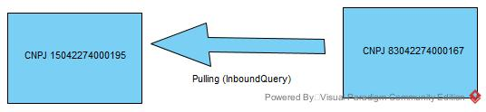

# QueryMessage Sample

In this hypothetical scenario a distributor received a physical shipment from a manufacturer but the shipment message was not received.

The distributor needs to have the information about all the serialized units with their respective hierarchies, to avoid individual readings for each serial number (sellable unit) received.

In this scenario, the distributors has the CNPJ 83042274000167 and is receiving 3 serialized units from the CNPJ 15042274000195.

- Sender - CNPJ 15042274000195 (Manufacturer)
- Receiver - CNPJ 83042274000167 (Distributor)

> Just to give a clear information, 
> the messages in this sample
> do not have the SIGNATURE tags

### Communication flow



Based on the scenario above, the distributor needs to check whether messages at the manufacturer’s side are available or not.

To do this, the distributor has to create the QueryRequest message and send to the manufacturer webservice.

### Creating the QueryRequest

```xml
<?xml version="1.0" encoding="UTF-8"?>
<QueryRequest xmlns="http://hc.gs1br.org.br/" date="2021-09-27T06:13:29Z" id="123456978696050595050AAAABBBDDDDD" schemaVersion="1.0">
    <sender>
        <partnerKey>CNPJ</partnerKey>
        <partnerValue>83042274000167</partnerValue>
    </sender>
    <receiver>
        <partnerKey>CNPJ</partnerKey>
        <partnerKey>15042274000195</partnerKey>
    </receiver>
    <queryRequestItem>
        <parameterKey>sender.Key</parameterKey>
        <parameterValue>CNPJ</parameterValue>
    </queryRequestItem>
    <queryRequestItem>
        <parameterKey>sender.Value</parameterKey>
        <parameterValue>15042274000195</parameterValue>
    </queryRequestItem>
	<queryRequestItem>
        <parameterKey>receiver.Key</parameterKey>
        <parameterValue>CNPJ</parameterValue>
    </queryRequestItem>
    <queryRequestItem>
        <parameterKey>receiver.Value</parameterKey>
        <parameterValue>83042274000167</parameterValue>
    </queryRequestItem>
	<queryRequestItem>
        <parameterKey>additionalInfo.key</parameterKey>
        <parameterValue>InvoiceNumber</parameterValue>
    </queryRequestItem>	
    <queryRequestItem>
        <parameterKey>additionalInfo.value</parameterKey>
        <parameterValue>1000988</parameterValue>
    </queryRequestItem>
</QueryRequest>
```

The manufacturer’s webservice will answer with the list of messages involved on that transaction.

### QueryResponse

````xml
<?xml version="1.0" encoding="UTF-8" standalone="yes"?>
<QueryResponse id="123456978696050595050AAAABBBDDDDD" date="2021-10-04T16:16:40Z" schemaVersion="1.0" xmlns="http://hc.gs1br.org.br/">
    <sender>
        <partnerKey>CNPJ</partnerKey>
        <partnerValue>15042274000195</partnerValue>
    </sender>
    <receiver>
        <partnerKey>CNPJ</partnerKey>
        <partnerValue>83042274000167</partnerValue>
    </receiver>
    <response>
        <queryResponseItem>
            <date>2021-10-04T16:16:40Z</date>
            <content format="SNCM" schemaVersion="1.0" encoding="XML">
                <fileURL>https://sampleurl.sampledomain.com/fileXXXXXXXX-0.xml</fileURL>
            </content>
        </queryResponseItem>
        <queryResponseItem>
            <date>2021-10-04T16:16:40Z</date>
            <content format="SNCM" schemaVersion="1.0" encoding="XML">
                <fileURL>https://sampleurl.sampledomain.com/fileXXXXXXXX-1.xml</fileURL>
            </content>
        </queryResponseItem>
        <queryResponseItem>
            <date>2021-10-04T16:16:40Z</date>
            <content format="SNCM" schemaVersion="1.0" encoding="XML">
                <fileURL>https://sampleurl.sampledomain.com/fileXXXXXXXX-2.xml</fileURL>
            </content>
        </queryResponseItem>
        <queryResponseItem>
            <date>2021-10-04T16:16:40Z</date>
            <content format="SNCM" schemaVersion="1.0" encoding="XML">
                <fileURL>https://sampleurl.sampledomain.com/fileXXXXXXXX-3.xml</fileURL>
            </content>
        </queryResponseItem>
        <queryResponseItem>
            <date>2021-10-04T16:16:40Z</date>
            <content format="EPCIS" schemaVersion="2.0" encoding="XML">
                <fileURL>https://sampleurl.sampledomain.com/fileXXXXXXXX-4.xml</fileURL>
            </content>
            <additionalInfo>
                <info key="AttorneyAuthorization">https://files.xxxx.com/0000000111212.xml</info>
            </additionalInfo>
        </queryResponseItem>       
    </response>
</QueryResponse>
```
