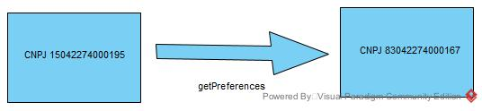

# QueryPreferences Sample

Following the previous workflow examples, in this section we will explain how to query a trading partner webservice to retrieve the partner’s Preferences.

In this hypothetical scenario, a manufacturer has the CNPJ 15042274000195 and its trading partner (distributor) has the CNPJ 83042274000167.

The manufacturer wants to know how messages need to be sent to the distributor’s webservice.

- Sender - CNPJ 15042274000195 (Manufacturer)
- Receiver - CNPJ 83042274000167 (Distributor)

> Just to give a clear information, 
> the messages in this sample
> do not have the SIGNATURE tags


### Communication flow



Based on the scenario above, the manufacturer will call the getPreferences method in the distributor’s webservice.

To perform this operation, a QueryRequest message has to be created and sent throught the manufacturer’s webservice.


### Creating the QueryRequest

```xml
<?xml version="1.0" encoding="UTF-8"?>
<QueryRequest xmlns="http://hc.gs1br.org.br/" date="2021-09-28T04:57:01Z" id="123456978696050595050AAAABBBDDDDD" schemaVersion="1.0">
    <sender>
        <partnerKey>CNPJ</partnerKey>
        <partnerValue>15042274000195</partnerValue>
    </sender>
    <receiver>
        <partnerKey>CNPJ</partnerKey>
        <partnerValue>83042274000167</partnerValue>
    </receiver>
    <queryRequestItem>
        <parameterKey>index</parameterKey>
        <parameterValue>0</parameterValue>
    </queryRequestItem>
    <queryRequestItem>
        <parameterKey>offset</parameterKey>
        <parameterValue>10</parameterValue>
    </queryRequestItem>
</QueryRequest>
```

The Distributor webservice will answer with the list of host preferences.

### QueryResponse

````xml
<?xml version="1.0" encoding="UTF-8" standalone="yes"?>
<PreferenceData id="056B8150AA384A8FA08990C7AE01E7ED" xmlns="http://hc.gs1br.org.br/">
    <partner>
        <partnerKey>CNPJ</partnerKey>
        <partnerValue>83042274000167</partnerValue>
    </partner>
    <preferences>
        <info key="key0">value0</info>
        <info key="key1">value1</info>
        <info key="key2">value2</info>
        <info key="key3">value3</info>
        <info key="key4">value4</info>
        <info key="key5">value5</info>
        <info key="key6">value6</info>
    </preferences>
</PreferenceData>
```
