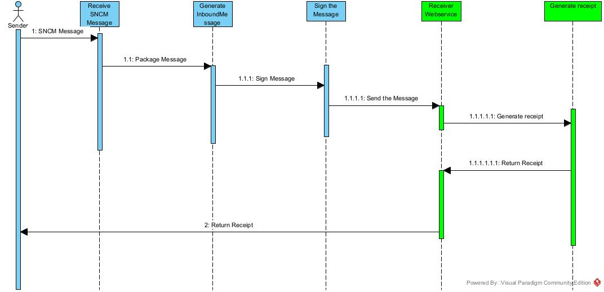

# Shipment Sample

Shipment is the first and most basic transaction happening in the supply chain, within a commercial transaction context between two trading partners.

In the shipment example below, we will use a hypothetical example of a manufacturer sending goods to a distributor.

Firstly, the manufacturer will need to generate the information about its shipment and submit it to the SNCM.

In this hypothetical scenario, the manufacturer has the CNPJ 15042274000195 and is sending 3 serialized units to its Distributor, with the CNPJ 83042274000167.

- Sender - CNPJ 15042274000195 (Manufacturer)
- Receiver - CNPJ 83042274000167 (Distributor)

> Just be aware that the messages 
> in this example do not have 
> the SIGNATURE tags

### Communication flow



### Sending message to SNCM

This is the message to be sent to the SNCM::

```xml
<?xml version="1.0" encoding="UTF-8" standalone="yes"?>
<msgEvtIn xmlns="http://sncm.anvisa.gov.br/">
    <docId>38C78456D9444E609F4E</docId>
    <ccTime>2021-08-19T19:29:31Z</ccTime>
    <ver>0.01</ver>
    <lc>pt-BR</lc>
    <env>1</env>
    <declarant>
        <cnpj>15042274000195</cnpj>
    </declarant>
    <mbrAgt>15042274000195</mbrAgt>
    <usrAgt>T2 Software S.A - V1.0</usrAgt>
    <evts>
        <shpt>
            <evtNotifId>73A1E095C3B547F281FF</evtNotifId>
            <realTime>true</realTime>
            <pastTime>2021-08-19T19:29:31Z</pastTime>
            <fit>false</fit>
            <prtnr>
                <cnpj>83042274000167</cnpj>
            </prtnr>
            <carrs>
                <car>
                    <cnpj>73042274000167</cnpj>
                </car>
            </carrs>
            <pld>
                <dui>
                    <gtin>07891234545454</gtin>
                    <serl>01010101001010</serl>
                    <exp>2021-08</exp>
                    <lot>LOTE</lot>
                </dui>
                <dui>
                    <gtin>07891234545454</gtin>
                    <serl>01010101001011</serl>
                    <exp>2021-08</exp>
                    <lot>LOTE</lot>
                </dui>
                <dui>
                    <gtin>07891234545454</gtin>
                    <serl>01010101001012</serl>
                    <exp>2021-08</exp>
                    <lot>LOTE</lot>
                </dui>                
            </pld>
        </shpt>
    </evts>
</msgEvtIn>
```

### Preparing the Horizontal Communication

Once the message is ready, the manufacturer needs to inform the distributor that the goods are being shipped. To perform this operation the manufacturer needs to package this information into the Horizontal Communication message called InboundMessage and the manufacturer also needs to know the address of the distributor's webservice.

There are two options to handle the information within the InboundMessage message.

- Store the message in a public address and use the fileurl tag;
- Encode the message in a BASE64 format and use the filecontent tag

In this example, we will use the base64 format.

The message in BASE64 is shown right below.

```base64
PD94bWwgdmVyc2lvbj0iMS4wIiBlbmNvZGluZz0iVVRGLTgiIHN0YW5kYWxvbmU9InllcyI/Pgo8bXNnRXZ0SW4geG1sbnM9Imh0dHA6Ly9zbmNtLmFudmlzYS5nb3YuYnIvIj4KICAgIDxkb2NJZD4zOEM3ODQ1NkQ5NDQ0RTYwOUY0RTwvZG9jSWQ+CiAgICA8Y2NUaW1lPjIwMjEtMDgtMTlUMTk6Mjk6MzFaPC9jY1RpbWU+CiAgICA8dmVyPjAuMDE8L3Zlcj4KICAgIDxsYz5wdC1CUjwvbGM+CiAgICA8ZW52PjE8L2Vudj4KICAgIDxkZWNsYXJhbnQ+CiAgICAgICAgPGNucGo+MTMwNDIyNzQwMDAxOTU8L2NucGo+CiAgICA8L2RlY2xhcmFudD4KICAgIDxtYnJBZ3Q+MTMwNDIyNzQwMDAxOTU8L21ickFndD4KICAgIDx1c3JBZ3Q+VDIgU29mdHdhcmUgUy5BIC0gVjEuMDwvdXNyQWd0PgogICAgPGV2dHM+CiAgICAgICAgPHNocHQ+CiAgICAgICAgICAgIDxldnROb3RpZklkPjczQTFFMDk1QzNCNTQ3RjI4MUZGPC9ldnROb3RpZklkPgogICAgICAgICAgICA8cmVhbFRpbWU+dHJ1ZTwvcmVhbFRpbWU+CiAgICAgICAgICAgIDxwYXN0VGltZT4yMDIxLTA4LTE5VDE5OjI5OjMxWjwvcGFzdFRpbWU+CiAgICAgICAgICAgIDxmaXQ+ZmFsc2U8L2ZpdD4KICAgICAgICAgICAgPHBydG5yPgogICAgICAgICAgICAgICAgPGNucGo+ODMwNDIyNzQwMDAxNjc8L2NucGo+CiAgICAgICAgICAgIDwvcHJ0bnI+CiAgICAgICAgICAgIDxjYXJycz4KICAgICAgICAgICAgICAgIDxjYXI+CiAgICAgICAgICAgICAgICAgICAgPGNucGo+NzMwNDIyNzQwMDAxNjc8L2NucGo+CiAgICAgICAgICAgICAgICA8L2Nhcj4KICAgICAgICAgICAgPC9jYXJycz4KICAgICAgICAgICAgPHBsZD4KICAgICAgICAgICAgICAgIDxkdWk+CiAgICAgICAgICAgICAgICAgICAgPGd0aW4+MDc4OTEyMzQ1NDU0NTQ8L2d0aW4+CiAgICAgICAgICAgICAgICAgICAgPHNlcmw+MDEwMTAxMDEwMDEwMTA8L3Nlcmw+CiAgICAgICAgICAgICAgICAgICAgPGV4cD4yMDIxLTA4PC9leHA+CiAgICAgICAgICAgICAgICAgICAgPGxvdD5MT1RFPC9sb3Q+CiAgICAgICAgICAgICAgICA8L2R1aT4KICAgICAgICAgICAgICAgIDxkdWk+CiAgICAgICAgICAgICAgICAgICAgPGd0aW4+MDc4OTEyMzQ1NDU0NTQ8L2d0aW4+CiAgICAgICAgICAgICAgICAgICAgPHNlcmw+MDEwMTAxMDEwMDEwMTE8L3Nlcmw+CiAgICAgICAgICAgICAgICAgICAgPGV4cD4yMDIxLTA4PC9leHA+CiAgICAgICAgICAgICAgICAgICAgPGxvdD5MT1RFPC9sb3Q+CiAgICAgICAgICAgICAgICA8L2R1aT4KICAgICAgICAgICAgICAgIDxkdWk+CiAgICAgICAgICAgICAgICAgICAgPGd0aW4+MDc4OTEyMzQ1NDU0NTQ8L2d0aW4+CiAgICAgICAgICAgICAgICAgICAgPHNlcmw+MDEwMTAxMDEwMDEwMTI8L3Nlcmw+CiAgICAgICAgICAgICAgICAgICAgPGV4cD4yMDIxLTA4PC9leHA+CiAgICAgICAgICAgICAgICAgICAgPGxvdD5MT1RFPC9sb3Q+CiAgICAgICAgICAgICAgICA8L2R1aT4gICAgICAgICAgICAgICAgCiAgICAgICAgICAgIDwvcGxkPgogICAgICAgIDwvc2hwdD4KICAgIDwvZXZ0cz4KPC9tc2dFdnRJbj4K
```

### Packaging the SNCM message within the HC InboundMessage Envelope.

Now the manufacturer needs to package the message into the InboundMessage in order to allow the message routing between the trading partners in the supply chain.

When the manufacturer packs this message into the InboundMessage, the XML below is created.

```xml
<?xml version="1.0" encoding="UTF-8" standalone="yes"?>
<InboundMessage id="123456978696050595050AAAABBBDDDDD" date="2021-09-29T10:26:49Z" schemaVersion="1.0" xmlns="http://hc.gs1br.org.br/">
    <sender>
        <partnerKey>CNPJ</partnerKey>
        <partnerValue>15042274000195</partnerValue>
    </sender>
    <receiver>
        <partnerKey>CNPJ</partnerKey>
        <partnerValue>83042274000167</partnerValue>
    </receiver>
    <carrier>
        <partnerKey>CNPJ</partnerKey>
        <partnerValue>73042274000167</partnerValue>
    </carrier>
    <content format="SNCM" schemaVersion="1.0" encoding="XML">   <fileContent>PD94bWwgdmVyc2lvbj0iMS4wIiBlbmNvZGluZz0iVVRGLTgiIHN0YW5kYWxvbmU9InllcyI/Pgo8bXNnRXZ0SW4geG1sbnM9Imh0dHA6Ly9zbmNtLmFudmlzYS5nb3YuYnIvIj4KICAgIDxkb2NJZD4zOEM3ODQ1NkQ5NDQ0RTYwOUY0RTwvZG9jSWQ+CiAgICA8Y2NUaW1lPjIwMjEtMDgtMTlUMTk6Mjk6MzFaPC9jY1RpbWU+CiAgICA8dmVyPjAuMDE8L3Zlcj4KICAgIDxsYz5wdC1CUjwvbGM+CiAgICA8ZW52PjE8L2Vudj4KICAgIDxkZWNsYXJhbnQ+CiAgICAgICAgPGNucGo+MTMwNDIyNzQwMDAxOTU8L2NucGo+CiAgICA8L2RlY2xhcmFudD4KICAgIDxtYnJBZ3Q+MTMwNDIyNzQwMDAxOTU8L21ickFndD4KICAgIDx1c3JBZ3Q+VDIgU29mdHdhcmUgUy5BIC0gVjEuMDwvdXNyQWd0PgogICAgPGV2dHM+CiAgICAgICAgPHNocHQ+CiAgICAgICAgICAgIDxldnROb3RpZklkPjczQTFFMDk1QzNCNTQ3RjI4MUZGPC9ldnROb3RpZklkPgogICAgICAgICAgICA8cmVhbFRpbWU+dHJ1ZTwvcmVhbFRpbWU+CiAgICAgICAgICAgIDxwYXN0VGltZT4yMDIxLTA4LTE5VDE5OjI5OjMxWjwvcGFzdFRpbWU+CiAgICAgICAgICAgIDxmaXQ+ZmFsc2U8L2ZpdD4KICAgICAgICAgICAgPHBydG5yPgogICAgICAgICAgICAgICAgPGNucGo+ODMwNDIyNzQwMDAxNjc8L2NucGo+CiAgICAgICAgICAgIDwvcHJ0bnI+CiAgICAgICAgICAgIDxjYXJycz4KICAgICAgICAgICAgICAgIDxjYXI+CiAgICAgICAgICAgICAgICAgICAgPGNucGo+NzMwNDIyNzQwMDAxNjc8L2NucGo+CiAgICAgICAgICAgICAgICA8L2Nhcj4KICAgICAgICAgICAgPC9jYXJycz4KICAgICAgICAgICAgPHBsZD4KICAgICAgICAgICAgICAgIDxkdWk+CiAgICAgICAgICAgICAgICAgICAgPGd0aW4+MDc4OTEyMzQ1NDU0NTQ8L2d0aW4+CiAgICAgICAgICAgICAgICAgICAgPHNlcmw+MDEwMTAxMDEwMDEwMTA8L3Nlcmw+CiAgICAgICAgICAgICAgICAgICAgPGV4cD4yMDIxLTA4PC9leHA+CiAgICAgICAgICAgICAgICAgICAgPGxvdD5MT1RFPC9sb3Q+CiAgICAgICAgICAgICAgICA8L2R1aT4KICAgICAgICAgICAgICAgIDxkdWk+CiAgICAgICAgICAgICAgICAgICAgPGd0aW4+MDc4OTEyMzQ1NDU0NTQ8L2d0aW4+CiAgICAgICAgICAgICAgICAgICAgPHNlcmw+MDEwMTAxMDEwMDEwMTE8L3Nlcmw+CiAgICAgICAgICAgICAgICAgICAgPGV4cD4yMDIxLTA4PC9leHA+CiAgICAgICAgICAgICAgICAgICAgPGxvdD5MT1RFPC9sb3Q+CiAgICAgICAgICAgICAgICA8L2R1aT4KICAgICAgICAgICAgICAgIDxkdWk+CiAgICAgICAgICAgICAgICAgICAgPGd0aW4+MDc4OTEyMzQ1NDU0NTQ8L2d0aW4+CiAgICAgICAgICAgICAgICAgICAgPHNlcmw+MDEwMTAxMDEwMDEwMTI8L3Nlcmw+CiAgICAgICAgICAgICAgICAgICAgPGV4cD4yMDIxLTA4PC9leHA+CiAgICAgICAgICAgICAgICAgICAgPGxvdD5MT1RFPC9sb3Q+CiAgICAgICAgICAgICAgICA8L2R1aT4gICAgICAgICAgICAgICAgCiAgICAgICAgICAgIDwvcGxkPgogICAgICAgIDwvc2hwdD4KICAgIDwvZXZ0cz4KPC9tc2dFdnRJbj4K</fileContent>
    </content>
</InboundMessage>
```

### Sending the message through the DataWS Webservice.

Once the XML is created, the manufacturer needs to send the InboundMessage to the receiver (distributor) webservice using the sendMessage method.

```xml
<soapenv:Envelope xmlns:soapenv="http://schemas.xmlsoap.org/soap/envelope/" xmlns:ws="http://ws.med.healthcare.gs1br.org/">
   <soapenv:Header/>
   <soapenv:Body>
      <ws:sendMessage>
         <inboundMessage><![CDATA[<?xml version="1.0" encoding="UTF-8" standalone="yes"?>
<InboundMessage id="123456978696050595050AAAABBBDDDDD" date="2021-09-29T10:26:49Z" schemaVersion="1.0" xmlns="http://hc.gs1br.org.br/">
    <sender>
        <partnerKey>CNPJ</partnerKey>
        <partnerValue>15042274000195</partnerValue>
    </sender>
    <receiver>
        <partnerKey>CNPJ</partnerKey>
        <partnerValue>83042274000167</partnerValue>
    </receiver>
    <carrier>
        <partnerKey>CNPJ</partnerKey>
        <partnerValue>73042274000167</partnerValue>
    </carrier>
    <content format="SNCM" schemaVersion="1.0" encoding="XML">
        <fileContent>PD94bWwgdmVyc2lvbj0iMS4wIiBlbmNvZGluZz0iVVRGLTgiIHN0YW5kYWxvbmU9InllcyI/Pgo8bXNnRXZ0SW4geG1sbnM9Imh0dHA6Ly9zbmNtLmFudmlzYS5nb3YuYnIvIj4KICAgIDxkb2NJZD4zOEM3ODQ1NkQ5NDQ0RTYwOUY0RTwvZG9jSWQ+CiAgICA8Y2NUaW1lPjIwMjEtMDgtMTlUMTk6Mjk6MzFaPC9jY1RpbWU+CiAgICA8dmVyPjAuMDE8L3Zlcj4KICAgIDxsYz5wdC1CUjwvbGM+CiAgICA8ZW52PjE8L2Vudj4KICAgIDxkZWNsYXJhbnQ+CiAgICAgICAgPGNucGo+MTMwNDIyNzQwMDAxOTU8L2NucGo+CiAgICA8L2RlY2xhcmFudD4KICAgIDxtYnJBZ3Q+MTMwNDIyNzQwMDAxOTU8L21ickFndD4KICAgIDx1c3JBZ3Q+VDIgU29mdHdhcmUgUy5BIC0gVjEuMDwvdXNyQWd0PgogICAgPGV2dHM+CiAgICAgICAgPHNocHQ+CiAgICAgICAgICAgIDxldnROb3RpZklkPjczQTFFMDk1QzNCNTQ3RjI4MUZGPC9ldnROb3RpZklkPgogICAgICAgICAgICA8cmVhbFRpbWU+dHJ1ZTwvcmVhbFRpbWU+CiAgICAgICAgICAgIDxwYXN0VGltZT4yMDIxLTA4LTE5VDE5OjI5OjMxWjwvcGFzdFRpbWU+CiAgICAgICAgICAgIDxmaXQ+ZmFsc2U8L2ZpdD4KICAgICAgICAgICAgPHBydG5yPgogICAgICAgICAgICAgICAgPGNucGo+ODMwNDIyNzQwMDAxNjc8L2NucGo+CiAgICAgICAgICAgIDwvcHJ0bnI+CiAgICAgICAgICAgIDxjYXJycz4KICAgICAgICAgICAgICAgIDxjYXI+CiAgICAgICAgICAgICAgICAgICAgPGNucGo+NzMwNDIyNzQwMDAxNjc8L2NucGo+CiAgICAgICAgICAgICAgICA8L2Nhcj4KICAgICAgICAgICAgPC9jYXJycz4KICAgICAgICAgICAgPHBsZD4KICAgICAgICAgICAgICAgIDxkdWk+CiAgICAgICAgICAgICAgICAgICAgPGd0aW4+MDc4OTEyMzQ1NDU0NTQ8L2d0aW4+CiAgICAgICAgICAgICAgICAgICAgPHNlcmw+MDEwMTAxMDEwMDEwMTA8L3Nlcmw+CiAgICAgICAgICAgICAgICAgICAgPGV4cD4yMDIxLTA4PC9leHA+CiAgICAgICAgICAgICAgICAgICAgPGxvdD5MT1RFPC9sb3Q+CiAgICAgICAgICAgICAgICA8L2R1aT4KICAgICAgICAgICAgICAgIDxkdWk+CiAgICAgICAgICAgICAgICAgICAgPGd0aW4+MDc4OTEyMzQ1NDU0NTQ8L2d0aW4+CiAgICAgICAgICAgICAgICAgICAgPHNlcmw+MDEwMTAxMDEwMDEwMTE8L3Nlcmw+CiAgICAgICAgICAgICAgICAgICAgPGV4cD4yMDIxLTA4PC9leHA+CiAgICAgICAgICAgICAgICAgICAgPGxvdD5MT1RFPC9sb3Q+CiAgICAgICAgICAgICAgICA8L2R1aT4KICAgICAgICAgICAgICAgIDxkdWk+CiAgICAgICAgICAgICAgICAgICAgPGd0aW4+MDc4OTEyMzQ1NDU0NTQ8L2d0aW4+CiAgICAgICAgICAgICAgICAgICAgPHNlcmw+MDEwMTAxMDEwMDEwMTI8L3Nlcmw+CiAgICAgICAgICAgICAgICAgICAgPGV4cD4yMDIxLTA4PC9leHA+CiAgICAgICAgICAgICAgICAgICAgPGxvdD5MT1RFPC9sb3Q+CiAgICAgICAgICAgICAgICA8L2R1aT4gICAgICAgICAgICAgICAgCiAgICAgICAgICAgIDwvcGxkPgogICAgICAgIDwvc2hwdD4KICAgIDwvZXZ0cz4KPC9tc2dFdnRJbj4K</fileContent>
    </content>
</InboundMessage>
]]></inboundMessage>
      </ws:sendMessage>
   </soapenv:Body>
</soapenv:Envelope>
```

### Webservice Response

The webservice will receive the message and will need to return an InboundResponse message which contains a receipt identification that must be stored by the sender in order to have the confirmation of the receiver.

```xml
<soap:Envelope xmlns:soap="http://schemas.xmlsoap.org/soap/envelope/">
   <soap:Body>
      <ns2:sendMessageResponse xmlns:ns2="http://ws.med.healthcare.gs1br.org/">
         <return><![CDATA[<?xml version="1.0" encoding="UTF-8" standalone="yes"?>
<InboundResponse id="F02529FCC82C42229898D3451A4E897E" date="2021-10-01T14:32:51Z" schemaVersion="1.0" xmlns="http://hc.gs1br.org.br/">
    <sender>
        <partnerKey>CNPJ</partnerKey>
        <partnerValue>83042274000167</partnerValue>
    </sender>
	<receiver>
        <partnerKey>CNPJ</partnerKey>
        <partnerValue>15042274000195</partnerValue>
    </receiver>
    <receipt>F02529FCC82C42229898</receipt>
</InboundResponse>]]></return>
      </ns2:sendMessageResponse>
   </soap:Body>
</soap:Envelope>
```
If there is any problem with the receiving process, the receiver server needs to send an InboundResponse with an error that indicates a problem exists and the message is not processed.

Problems can happen if the trading partner is unknown to the receiver, problems with the message format, problems with the Authorization, with the certificate, with the signature etc.

### Webservice Response with Error

Below you can find an example of an InboundResponse confirming an Error occurred.

If you get an error tag instead of a receipt, be aware that the message cannot be considered as delivered.

```xml
<?xml version="1.0" encoding="UTF-8" standalone="yes"?>
<InboundResponse id="123456978696050595050AAAABBBDDDDD" date="2021-09-29T10:26:49Z" schemaVersion="1.0" xmlns="http://hc.gs1br.org.br/">
    <sender>
        <partnerKey>CNPJ</partnerKey>
        <partnerValue>15042274000195</partnerValue>
    </sender>
    <receiver>
        <partnerKey>CNPJ</partnerKey>
        <partnerValue>83042274000167</partnerValue>
    </receiver>
    <error>
        <errorCode>401</errorCode>
        <errorDescription>Unauthorized</errorDescription>
    </error>
</InboundResponse>
```